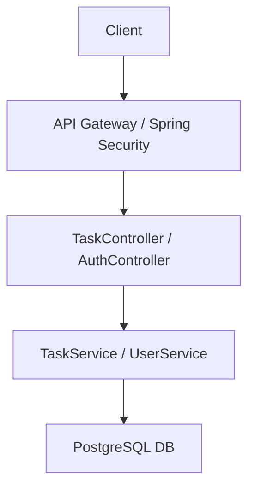

# Task Management API

A secure **RESTful API** built with **Java** and **Spring Boot** for managing tasks. Users can register, log in, and perform CRUD operations on tasks. The API supports **JWT-based authentication**, **role-based access control**, filtering, sorting, and Docker deployment.

---

## 🛠 **Tech Stack**

- **Backend:** Java, Spring Boot  
- **Security:** Spring Security, JWT  
- **Database:** PostgreSQL, JPA/Hibernate  
- **Testing:** JUnit, Mockito  
- **Documentation:** Swagger/OpenAPI  
- **Deployment:** Docker  

---

## 🔹 **Features**

- **User Management:**  
  - Register and log in with hashed passwords  
  - Role-based access (user/admin)  

- **Task Management:**  
  - Create, read, update, and delete tasks  
  - Filter by status, priority, and due date  
  - Pagination and sorting  
  - Assign tasks to other users  

- **Security:**  
  - JWT authentication for protected endpoints  
  - Role-based authorization for admin and standard users  

- **Testing & Documentation:**  
  - Unit and integration tests with JUnit/Mockito  
  - Swagger UI for interactive API exploration  

---

## 🔗 **Architecture Overview**



## ⚡ **Getting Started**

### 1. Clone the repository

```bash
git clone https://github.com/mdia349/task-management-api.git
cd task-management-api
```

### 2. Configure PostgreSQL
- Create a database (e.g., taskdb)
- Update application.yml:
  ```bash
  spring:
  datasource:
    url: jdbc:postgresql://localhost:5432/taskdb
    username: your_username
    password: your_password
  jpa:
    hibernate:
      ddl-auto: update
    show-sql: true
  ```

### 3. Build and Run
Using Maven:
```bash
mvn clean install
mvn spring-boot:run
```
Using Docker:
```bash
docker-compose up --build
```

- API available at http://localhost:8080

- OpenAPI UI: http://localhost:8080/v1

## 📌 API Endpoints

| Endpoint             | Method | Request Body                                   | Response                   | Description                      |
| -------------------- | ------ | ---------------------------------------------- | -------------------------- | -------------------------------- |
| `/auth/register`     | POST   | `{ "username": "user", "password": "pass" }`   | `201 Created`              | Register new user                |
| `/auth/login`        | POST   | `{ "username": "user", "password": "pass" }`   | `{ "token": "JWT_TOKEN" }` | Log in and get JWT               |
| `/tasks`             | GET    | —                                              | List of tasks              | Get all tasks                    |
| `/tasks`             | POST   | `{ "title": "Task 1", "description": "Desc" }` | Created Task               | Create a new task                |
| `/tasks/{id}`        | GET    | —                                              | Task object                | Get task by ID                   |
| `/tasks/{id}`        | PUT    | `{ "title": "Updated Task" }`                  | Updated Task               | Update task                      |
| `/tasks/{id}`        | DELETE | —                                              | `204 No Content`           | Delete task                      |

## 🧪 Running Tests

```bash
mvn test
```
- Unit tests for services
- Integration tests for controllers using H2 in-memory DB

## 🚀 Deployment
- Dockerized with `Dockerfile` and `docker-compose.yml`
- Ready for deployment on **Heroku, AWS, or any Docker-supported cloud**

